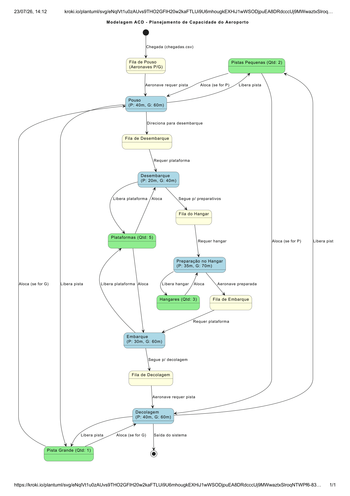
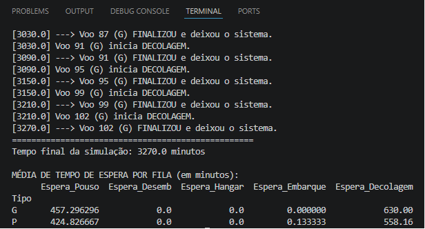

# Prova de simulação discreta

**Universidade Federal do Pará (UFPA)**  
**Instituto de Ciências Exatas e Naturais (ICEN)** — **Faculdade de Computação**  
**Disciplina:** Simulação Discreta 
**Professor:** Dr. Filipe de Oliveira Saraiva  
**Alunos:** João Vitor Yokoyama Nobayashi, Thiago Mendes de Castro Correia, 

---

## Sumário
1. [Modelagem ACD ](#1-modelagem-acd-activity-cycle-diagram)
2. [Análise dos Cenários e Resultados das Simulações](#2-análise-dos-cenários-e-resultados-das-simulações)
3. [Análise Econômica e de Viabilidade das Soluções](#3-análise-econômica-e-de-viabilidade-das-soluções)

---

---

## 1. Modelagem ACD (Activity Cycle Diagram)

### Tempos Operacionais:
| Operação | Pequeno Porte (P) | Grande Porte (G) |
| :--- | :---: | :---: |
| **Pouso** | 40 | 60 |
| **Desembarque** | 20 | 40 |
| **Hangar** | 35 | 70 |
| **Embarque** | 30 | 60 |
| **Decolagem** | 40 | 60 |

---

## 2. Identificação dos gargalos do sistema e criação de cenários que reduzam os gargalos;

Ao realizar a execução da simulação para o cenário padrão, identificamos gargarlo no pouso e decolagem

portanto, criamos os seguintes cenários para otimizar o fluxo

| Cenário | Tempo Final | Ganho (Base) | Ganho (vs Anterior) | Pouso (P/G) | Desemb. (P/G) | Hangar (P/G) | Embarque (P/G) | Decolagem (P/G) |
| :--- | :--- | :--- | :--- | :--- | :--- | :--- | :--- | :--- |
| **Cenário Padrão** | 3270.0 min | - | - | 424.83 / 457.30 | 0.00 / 0.00 | 0.00 / 0.00 | 0.13 / 0.00 | 558.16 / 630.00 |
| **+1 Pista P e +1 Pista G** | 2060.0 min | 37,00% | **37,00%** | 147.68 / 35.11 | 0.36 / 0.33 | 0.00 / 0.07 | 0.36 / 0.00 | 175.85 / 36.15 |
| **+2 Pistas P e +1 Pista G** | 1813.0 min | 44,56% | **11,99%** | 18.64 / 35.44 | 0.56 / 0.96 | 0.15 / 0.07 | 0.76 / 1.07 | 18.97 / 36.67 |
| **+2 Pistas P e +2 Pista G** | 1729.0 min | 47,13% | **4,63%** | 18.67 / 0.22 | 1.28 / 1.67 | 0.05 / 0.22 | 1.27 / 1.44 | 17.88 / 0.15 |

---

## 3. Análise Econômica e de Viabilidade das Soluções

1. **Prejuízos do Cenário Base (Inviável):**
   * **Custos Operacionais Elevados:** Filas de pouso chegam a durar mais de 7 horas (457,30 minutos para aeronaves G e 424,83 minutos para aeronaves P), gerando um consumo excessivo de Querosene de Aviação (QAV) enquanto as aeronaves realizam procedimentos de espera em voo (órbita).
   * **Colapso Sistêmico:** Atrasos para a decolagem atingem até 10,5 horas (630 minutos). Isso inviabiliza completamente a operação comercial, acarretando indenizações altíssimas aos passageiros, multas pesadas das agências reguladoras (como a ANAC) e a perda iminente de contratos operacionais com companhias aéreas.

2. **Viabilidade do Cenário "+1 Pista P e +1 Pista G":**
   * Apresenta o maior salto inicial de eficiência (ganho de 37%), resolvendo o estrangulamento crítico dos voos de grande porte (a espera cai de 630 para cerca de 36 minutos). Contudo, aeronaves de pequeno porte (P) ainda enfrentam quase 3 horas de retenção (175,85 min na decolagem e 147,68 min no pouso), mantendo elevados os custos para a malha regional ou executiva.

3. **Viabilidade Econômica do Cenário "+2 Pistas P e +1 Pista G" (RECOMENDADO / Melhor Custo-Benefício):**
   * **Eficiência e Equilíbrio:** A expansão focada em pistas menores estabiliza o sistema. Os tempos de espera de aeronaves de pequeno porte despencam para a casa dos 18 minutos, agregando quase 12% de ganho de tempo em relação à expansão anterior.
   * **Direcionamento do CAPEX (Despesas de Capital):** A simulação prova que **não há necessidade de expansão em plataformas ou hangares**, visto que o tempo de espera nestes setores permanece próximo de zero (máximo de 1,07 minutos). O aeroporto economiza recursos valiosos ao não investir em obras civis nos pátios, canalizando o orçamento estritamente para o asfaltamento e homologação das novas pistas.

4. **Cenário "+2 Pistas P e +2 Pistas G" (Baixo Retorno Marginal):**
   * Apesar de gerar a operação mais rápida do estudo e praticamente zerar a espera de aeronaves grandes (0,15 min para decolagem), o ganho no tempo global é de apenas 4,63% em relação ao cenário anterior. O investimento multimilionário exigido para construir uma pista extra de grande porte não se justifica financeiramente (baixo ROI) frente a um ganho de capacidade operacional tão estreito.

---

